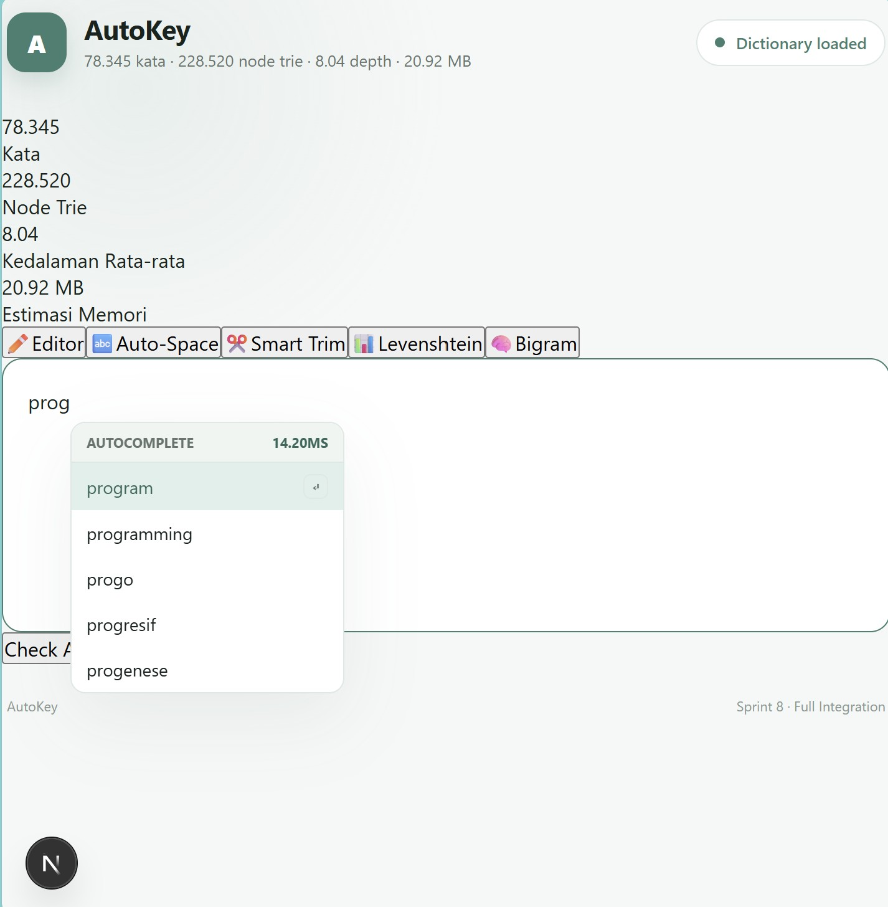
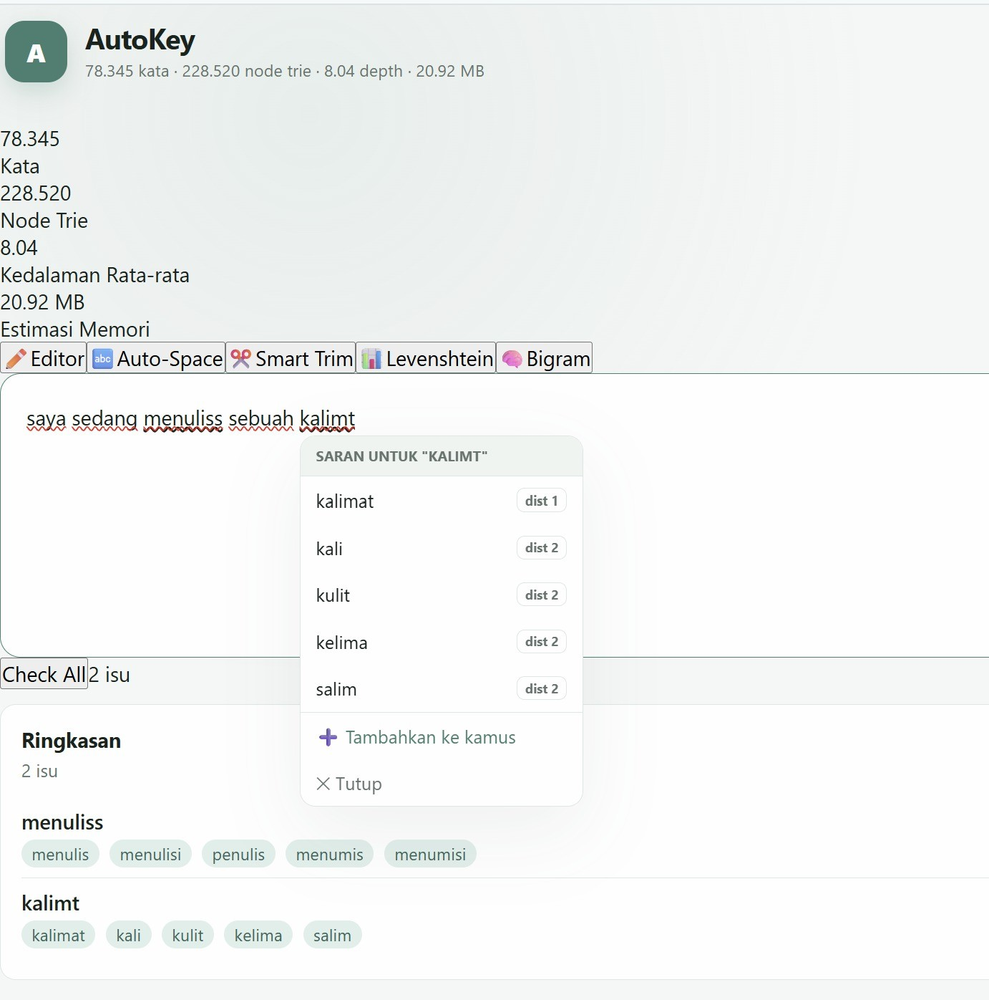
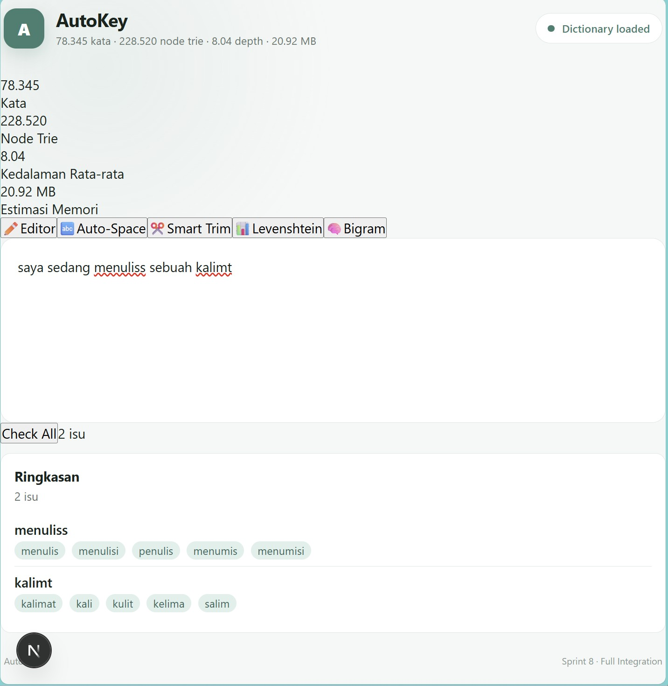
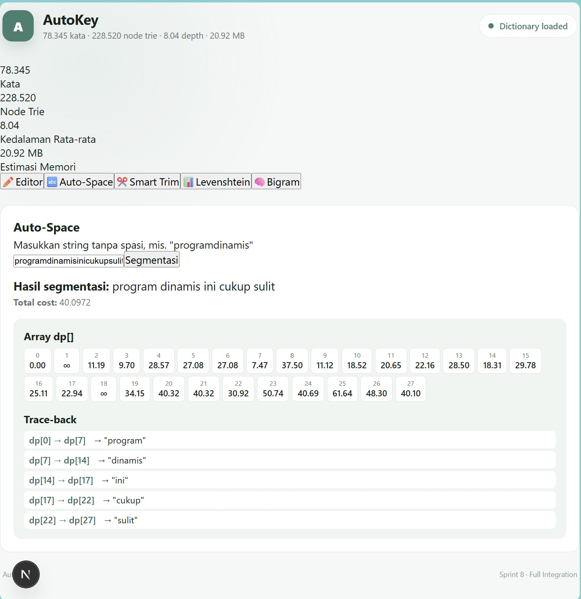
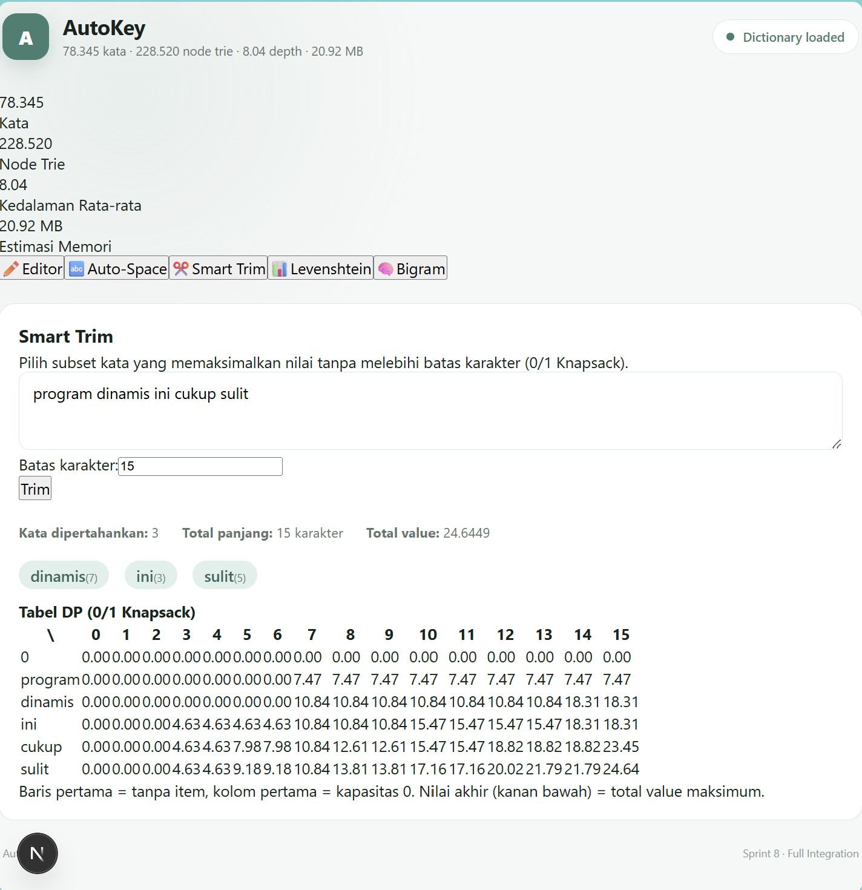
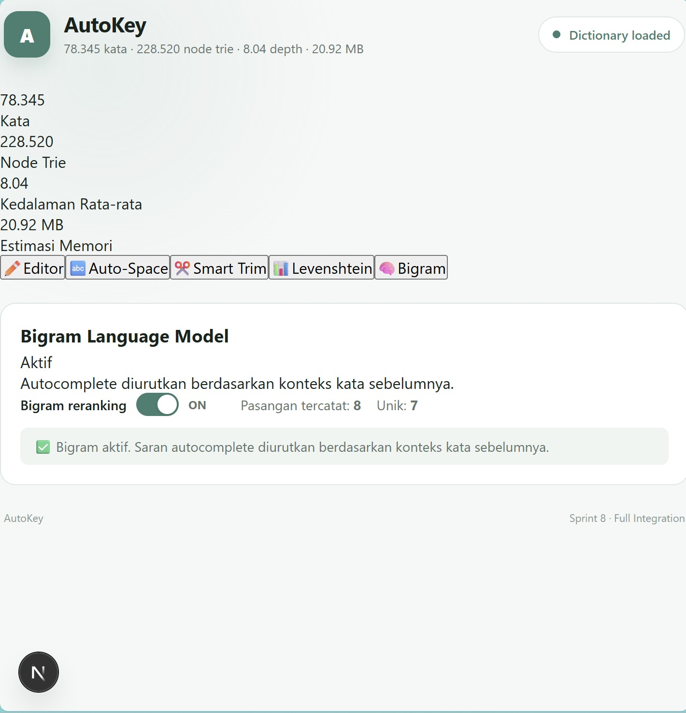

# AutoKey

**Autocomplete dan Spell Checker Bahasa Indonesia berbasis Trie dan Dynamic Programming**

> Task Seleksi Asisten Lab IRK 2026, dibuat untuk memenuhi spesifikasi OHL_AutoKey

---

## Daftar Isi

- [Deskripsi Program](#deskripsi-program)
- [Fitur Program](#fitur-program)
  - [Fitur Wajib](#fitur-wajib)
  - [Fitur Bonus](#fitur-bonus)
- [Tech Stack](#tech-stack)
- [Struktur Proyek](#struktur-proyek)
- [Cara Menjalankan Program](#cara-menjalankan-program)
- [Penjelasan Trie](#penjelasan-trie)
- [Penjelasan Levenshtein Edit Distance](#penjelasan-levenshtein-edit-distance)
- [Penjelasan Word Segmentation](#penjelasan-word-segmentation)
- [Penjelasan Fitur Bonus](#penjelasan-fitur-bonus)
  - [Smart Trim (0/1 Knapsack)](#smart-trim-01-knapsack)
  - [Bigram Language Model](#bigram-language-model)
- [Dokumentasi API](#dokumentasi-api)
- [Pengujian](#pengujian)
- [Screenshot Program](#screenshot-program)
- [Tautan Video Demo](#tautan-video-demo)
- [Referensi](#referensi)

---

## Deskripsi Program

**AutoKey** adalah aplikasi web teks editor Bahasa Indonesia yang dibangun dari nol untuk mempraktikkan tiga konsep algoritma:

1. **Trie**: struktur pohon untuk pencarian prefix yang efisien yang digunakan untuk autocomplete real-time.
2. **Levenshtein Edit Distance**: Dynamic Programming klasik untuk menghitung jarak edit minimal antar kata yang digunakan untuk spell checking.
3. **Word Segmentation**: varian DP untuk membelah string tanpa spasi menjadi kata-kata valid berdasarkan kamus yang digunakan untuk fitur Auto-Space.

Ketiga konsep tersebut diimplementasikan **100% dari nol** (tanpa library Trie maupun library fuzzy-matching/string-similarity apa pun) dan digabungkan menjadi satu aplikasi teks editor yang responsif: autocomplete yang muncul tiap keystroke, spell check otomatis dengan garis bawah merah, serta Auto-Space yang merapikan teks tanpa spasi dalam satu klik.

Aplikasi ini dibangun dengan backend **FastAPI (Python)** yang memuat kamus 78.345 kata Bahasa Indonesia saat startup dan membangun Trie di memori, serta frontend **Next.js (TypeScript/React)** dengan editor berbasis `contenteditable` yang berkomunikasi dengan backend melalui REST API.

Dua fitur bonus turut diimplementasikan: **Smart Trim** (pemendekan teks otomatis berbasis 0/1 Knapsack) dan **Bigram Language Model** (autocomplete kontekstual yang mempelajari pasangan kata selama sesi pengetikan berjalan).

---

## Fitur Program

### Fitur Wajib

| Fitur | Deskripsi |
|---|---|
| **Load Kamus dan Build Trie** | Kamus `data/kamus.json` (78.345 kata) dimuat backend saat *startup* dan dibangun menjadi Trie custom (`app/core/trie.py`), lengkap dengan `insert`, `search`, `starts_with`, dan `get_suggestions`. |
| **Statistik Trie** | Ditampilkan otomatis di header UI begitu aplikasi start: jumlah kata, jumlah node, kedalaman rata-rata, dan estimasi memory usage. |
| **Autocomplete** | Dropdown top-5 saran muncul tiap keystroke (debounce 30ms, latency backend biasanya < 5ms), diurutkan berdasarkan frekuensi. Mendukung `Tab`/`Enter` untuk melengkapi kata dan navigasi `Arrow Up`/`Down`. |
| **Levenshtein Edit Distance** | Tabel DP `n×m` eksplisit dengan basis dan relasi rekurens sesuai spesifikasi, dapat divisualisasikan lewat panel Levenshtein di UI. |
| **Spell Check di Editor** | Kata yang tidak ada di kamus digarisbawahi merah bergelombang. Klik kata → muncul top-5 saran (jarak ≤ 2, diurutkan jarak ASC lalu frekuensi DESC) + opsi "Tambah ke kamus". Tombol **Check All** memindai seluruh teks dan menampilkan hasil di panel Ringkasan. |
| **Word Segmentation (Auto-Space)** | User memasukkan string tanpa spasi → sistem menyegmentasikannya secara optimal menggunakan DP berbasis cost `log(N/freq(w))`. Array `dp[]` lengkap dan trace-back ditampilkan di UI, bukan hanya hasil akhir. |

### Fitur Bonus

| Fitur | Deskripsi |
|---|---|
| **Smart Trim** | Pemendekan teks otomatis berbasis 0/1 Knapsack, memilih subset kata yang memaksimalkan total *value* (`log(N/freq)`) tanpa melebihi batas karakter yang ditentukan user. Kata yang dipertahankan direkonstruksi mundur dari tabel DP. |
| **Bigram Language Model** | Autocomplete direranking berdasarkan probabilitas kata berikutnya `P(kata_B \| kata_A)` dari pasangan kata yang tercatat selama sesi berjalan. Dilengkapi toggle ON/OFF dan counter jumlah pasangan tercatat. |

---

## Tech Stack

**Backend**
- **Python 3.13** + **FastAPI 0.116**: REST API, validasi request/response dengan Pydantic
- **Uvicorn**: ASGI server
- **Pytest** + **httpx**: testing (200+ test case)

**Frontend**
- **Next.js 15** (App Router) + **React 19** + **TypeScript 5.9**
- Native `contenteditable` untuk editor (tanpa library rich-text editor pihak ketiga)
- CSS custom (tanpa framework UI berat) + sebagian kelas utility Tailwind-style untuk komponen baru

**Tidak ada library Trie, fuzzy-matching, atau string-similarity yang digunakan**. Seluruh algoritma inti (Trie, Levenshtein DP, Word Segmentation DP, 0/1 Knapsack DP, Bigram counting) diimplementasikan dari nol di `backend/app/core/`.

---

## Struktur Proyek

```
OHL_AutoKey/
├── backend/
│   ├── app/
│   │   ├── core/                  # Algoritma inti (from scratch)
│   │   │   ├── trie.py            # Trie: insert, search, starts_with, get_suggestions
│   │   │   ├── levenshtein.py     # DP Levenshtein: tabel n×m + fungsi distance
│   │   │   ├── segmentation.py    # DP Word Segmentation: dp[], traceback
│   │   │   ├── knapsack.py        # DP 0/1 Knapsack (Smart Trim)
│   │   │   └── bigram.py          # Bigram counting & probability
│   │   ├── services/              # Orkestrasi logika bisnis
│   │   ├── api/routes/            # Endpoint FastAPI
│   │   ├── api/schemas/           # Pydantic request/response models
│   │   ├── models/                # TrieNode, DictionaryEntry, Session
│   │   ├── utils/                 # statistics.py, scoring.py
│   │   └── main.py                # Entry point + lifespan (load kamus saat start)
│   ├── tests/                     # 200+ test case (pytest)
│   └── requirements.txt
├── frontend/
│   ├── app/                       # Next.js App Router (page.tsx, layout.tsx)
│   ├── components/
│   │   ├── editor/                # TextEditor, AutocompleteDropdown, SpellSuggestion, IssueList
│   │   ├── features/              # AutoSpacePanel, SmartTrimPanel, LevenshteinPanel, BigramPanel
│   │   ├── dp/                    # DPTable, KnapsackTable (visualisasi tabel DP)
│   │   ├── layout/                # Header, SummaryPanel, MainLayout
│   │   └── common/                # Button, Badge, Tabs, Toggle, Loading
│   ├── hooks/                     # useEditor, useAutocomplete, useSpellcheck, dst
│   ├── services/                  # API client per fitur
│   └── types/                     # TypeScript types
├── data/
│   └── kamus.json                 # 78.345 kata Bahasa Indonesia + frekuensi
├── screenshots/                   # Screenshot UI untuk dokumentasi
├── .env.example
└── README.md
```

---

## Cara Menjalankan Program

### Prasyarat

- Python 3.11+
- Node.js 18+
- `data/kamus.json` sudah tersedia di root proyek

### 1. Menjalankan Backend

```bash
cd backend
python -m venv venv

# Aktivasi virtual environment
venv\Scripts\activate        # Windows
source venv/bin/activate     # macOS/Linux

pip install -r requirements.txt
uvicorn app.main:app --reload
```

Backend akan berjalan di `http://localhost:8000`. Saat startup, kamus otomatis dimuat dan Trie dibangun (dapat diverifikasi lewat `GET /statistics`).

### 2. Menjalankan Frontend

Di terminal terpisah:

```bash
cd frontend
npm install
npm run dev
```

Frontend akan berjalan di `http://localhost:3000` dan otomatis terhubung ke backend melalui `NEXT_PUBLIC_API_URL` (default `http://localhost:8000`, dapat dikonfigurasi lewat `.env.local`, lihat `.env.example`).

### 3. Verifikasi

Buka `http://localhost:3000` di browser. Header akan menampilkan statistik Trie (jumlah kata, node, kedalaman rata-rata, estimasi memori) begitu backend berhasil terhubung.

### 4. Menjalankan Test

```bash
cd backend
pytest
```

Seluruh 200+ test case (Trie, Levenshtein, Segmentation, Knapsack, Bigram, service layer, dan API endpoint) akan dijalankan.

```bash
cd frontend
npm run typecheck   # Verifikasi TypeScript
npm run build       # Build produksi
```

---

## Penjelasan Trie

### Struktur Data

Trie diimplementasikan dari nol menggunakan `dict` per node (`backend/app/core/trie.py`), tanpa library Trie apa pun:

```python
@dataclass(slots=True)
class TrieNode:
    children: dict[str, "TrieNode"] = field(default_factory=dict)
    is_word: bool = False
    frequency: int = 0
```

Setiap karakter direpresentasikan sebagai satu edge menuju child node. Kata dianggap berakhir pada node dengan `is_word = True`, membawa nilai `frequency` dari kamus.

### Operasi

| Operasi | Kompleksitas | Deskripsi |
|---|---|---|
| `insert(word, frequency)` | O(L) | L = panjang kata. Membuat node baru sepanjang path jika belum ada. |
| `search(word)` | O(L) | Menyusuri path karakter demi karakter; `True` hanya jika node akhir punya `is_word = True`. |
| `starts_with(prefix)` | O(L) | Sama seperti `search`, tapi tidak memeriksa `is_word`, cukup memeriksa keberadaan node di ujung path. |
| `get_suggestions(prefix, top_n)` | O(L + K log(top_n)) | Menyusuri ke node prefix, lalu DFS ke seluruh subtree sambil menjaga *bounded max-heap* berukuran `top_n` (K = jumlah kata di subtree) sehingga tidak perlu mengumpulkan dan mengurutkan semua kandidat. |

### Statistik yang Ditampilkan

Dihitung di `backend/app/utils/statistics.py` dan diekspos lewat `GET /statistics`:

- **Jumlah kata ter-insert**: `trie.word_count`
- **Jumlah node**: `trie.node_count` (termasuk root)
- **Kedalaman rata-rata**: rata-rata `depth` dari root ke setiap node yang menandai akhir kata (dihitung via traversal iteratif, bukan rekursif, untuk menghindari stack overflow pada kamus besar)
- **Estimasi memory usage**: `node_count × ESTIMATED_NODE_SIZE_BYTES` (96 byte per node, estimasi berdasarkan overhead objek Python untuk `dict` kosong + 2 field primitif)

### Ranking Autocomplete

Kandidat diurutkan berdasarkan key `(-frequency, word)`: frekuensi **descending** dengan kata sebagai tie-breaker alfabetis untuk hasil yang deterministik saat frekuensi sama.

---

## Penjelasan Levenshtein Edit Distance

### Konsep

Levenshtein Edit Distance mengukur jumlah operasi minimal (insert, delete, substitute) untuk mengubah satu string menjadi string lain. Diimplementasikan di `backend/app/core/levenshtein.py` sebagai tabel DP eksplisit berukuran `(n+1) × (m+1)`.

### Basis

```
dp[i][0] = i   untuk semua i   (menghapus i karakter dari source untuk menjadi string kosong)
dp[0][j] = j   untuk semua j   (menyisipkan j karakter untuk membentuk target dari string kosong)
```

### Relasi Rekurens

```
dp[i][j] = min(
    dp[i-1][j]   + 1,           # delete
    dp[i][j-1]   + 1,           # insert
    dp[i-1][j-1] + cost         # substitute (atau match jika cost=0)
)

cost = 0  jika source[i-1] == target[j-1]
cost = 1  jika berbeda
```

### Implementasi

```python
def compute_distance_table(source: str, target: str) -> LevenshteinTable:
    n, m = len(source), len(target)
    dp = [[0] * (m + 1) for _ in range(n + 1)]

    for i in range(n + 1):
        dp[i][0] = i
    for j in range(m + 1):
        dp[0][j] = j

    for i in range(1, n + 1):
        for j in range(1, m + 1):
            cost = 0 if source[i-1] == target[j-1] else 1
            dp[i][j] = min(dp[i-1][j] + 1, dp[i][j-1] + 1, dp[i-1][j-1] + cost)

    return LevenshteinTable(source, target, dp, dp[n][m])
```

Fungsi ini mengembalikan **tabel DP penuh**, bukan hanya nilai akhir, sehingga dapat divisualisasikan di UI (panel Levenshtein) untuk menunjukkan proses perhitungan, bukan cuma hasilnya. Contoh kanonik `"kitten"` → `"sitting"` menghasilkan `dp[6][7] = 3`.

Untuk kebutuhan pencarian massal (spell check terhadap 78k kata), tersedia fungsi terpisah `levenshtein_distance()` yang hanya menyimpan dua baris DP (`previous_row`/`current_row`) alih-alih tabel penuh untuk mengurangi kompleksitas ruang dari O(n×m) menjadi O(m) tanpa mengubah hasil karena hanya nilai akhir yang dibutuhkan saat scanning kamus.

### Pencarian Kandidat Spell Check

`SpellCheckService.find_words_within_distance(word, max_distance=2)` di `backend/app/services/spellcheck_service.py`:

1. Melakukan **pruning berdasarkan selisih panjang**: kata kamus yang selisih panjangnya dengan `word` melebihi `max_distance` langsung dilewati (valid karena selisih panjang adalah *lower bound* dari edit distance sehingga tidak mengubah hasil, hanya mempercepat pencarian).
2. Menghitung `levenshtein_distance()` untuk kandidat yang lolos pruning.
3. Menyaring kandidat dengan `distance ≤ max_distance`.
4. **Sorting**: `distance ASC`, lalu `frequency DESC`, lalu `word ASC` sebagai tie-breaker final:

```python
candidates.sort(key=lambda c: (c.distance, -c.frequency, c.word))
```

Fungsi ini dipakai di dua tempat: saat user klik kata bergaris merah (`GET /spellcheck/word`) dan saat scan seluruh teks lewat tombol **Check All** (`POST /spellcheck/check-text`).

---

## Penjelasan Word Segmentation

### Konsep

Word Segmentation (Auto-Space) membelah string tanpa spasi menjadi urutan kata valid yang meminimalkan total *cost*, dimodelkan sebagai varian Dynamic Programming (mirip *Word Break Problem*), diimplementasikan di `backend/app/core/segmentation.py`.

### Basis

```
dp[0] = 0
```

`dp[0]` merepresentasikan cost minimal untuk menyegmentasikan string kosong (0 karakter pertama), yaitu 0 karena tidak ada apa pun yang perlu disegmentasikan.

### Relasi Rekurens

Untuk setiap posisi `i` (1 ≤ i ≤ n), pertimbangkan semua kemungkinan potongan terakhir `s[j..i-1]`:

```
dp[i] = min atas semua j < i di mana s[j..i-1] valid di kamus:
            dp[j] + cost(s[j..i-1])
```

### Cost Function

```
cost(w) = log(N / freq(w))

N        = total kemunculan seluruh kata di kamus (Σ semua nilai frekuensi, bukan jumlah kata unik)
`freq(w)` adalah frekuensi kata di kamus (minimal 1 — kata dengan frekuensi 0 di-clamp ke 1 agar cost terdefinisi). Hanya kata yang terdaftar di kamus yang dipertimbangkan sebagai kandidat segmentasi; kata yang tidak ada diabaikan.
```

Ini adalah bentuk **Inverse Document Frequency (IDF)**. Kata yang sering muncul (freq tinggi) punya cost rendah sehingga DP secara natural memilih segmentasi yang menggunakan kata-kata umum, bukan kata langka yang kebetulan cocok secara substring.

### Implementasi

```python
def segment_text(text, word_freq, total_frequency):
    n = len(text)
    dp = [INF] * (n + 1)
    choice = [-1] * (n + 1)
    dp[0] = 0.0

    for i in range(1, n + 1):
        for j in range(i):
            substring = text[j:i]
            freq = word_freq.get(substring)
            if freq is None:
                continue
            effective_freq = max(freq, 1)          # freq(w) >= 1
            cost = math.log(total_frequency / effective_freq)
            if dp[j] + cost < dp[i]:
                dp[i] = dp[j] + cost
                choice[i] = j
    ...
```

> **Catatan implementasi:** kata dengan `freq = 0` di kamus (kasus tepi yang bisa terjadi lewat fitur "Tambah ke kamus" jika di masa depan diberi frekuensi 0) tetap dianggap **valid** sebagai kandidat segmentasi, hanya kata yang benar-benar **tidak ada** di kamus (`freq is None`) yang di-skip. Nilai `freq` di-*clamp* minimal 1 saat menghitung cost, sesuai spesifikasi `freq(w) >= 1`.

### Trace-back

Array `choice[]` menyimpan indeks `j` optimal untuk setiap `i`, memungkinkan rekonstruksi mundur:

```python
words = []
i = n
while i > 0:
    j = choice[i]
    words.append(text[j:i])
    i = j
words.reverse()
```

Kompleksitas total: **O(n²)** untuk mengisi tabel `dp[]` (n = panjang string input) karena setiap posisi `i` memeriksa semua `j < i`.

### Tampilan UI

Berbeda dari sekadar menampilkan hasil akhir, komponen `AutoSpacePanel.tsx` + `DPTable.tsx` menampilkan:

- **Array `dp[]` lengkap**: setiap sel menunjukkan indeks dan nilai cost kumulatif (∞ jika belum terjangkau)
- **Trace-back eksplisit**: urutan langkah `dp[j] → dp[i]` beserta kata yang dipilih pada tiap langkah

Contoh: input `"programdinamis"` menghasilkan `dp[0] → dp[7]` lewat kata **"program"**, lalu `dp[7] → dp[14]` lewat kata **"dinamis"**.

---

## Penjelasan Fitur Bonus

### Smart Trim (0/1 Knapsack)

Diimplementasikan di `backend/app/core/knapsack.py`, memodelkan pemendekan teks sebagai masalah 0/1 Knapsack klasik: setiap kata adalah item dengan `weight` = panjang karakter kata, dan `value` = `log(N/freq(word))` (sama seperti cost pada Word Segmentation, kata langka/informatif punya value lebih tinggi).

**Basis:**
```
dp[0][w] = 0   untuk semua w
```

**Relasi Rekurens:**
```
dp[i][w] = max(dp[i-1][w], dp[i-1][w - weight_i] + value_i)   jika w >= weight_i
dp[i][w] = dp[i-1][w]                                          jika tidak
```

```python
for i in range(1, n + 1):
    _, weight, value = items[i - 1]
    for w in range(capacity + 1):
        if weight <= w and dp[i-1][w-weight] + value > dp[i-1][w]:
            dp[i][w] = dp[i-1][w-weight] + value
            keep[i][w] = True
        else:
            dp[i][w] = dp[i-1][w]
            keep[i][w] = False
```

Matriks `keep[][]` terpisah digunakan untuk trace-back, kata mana saja yang dipertahankan direkonstruksi mundur dari `dp[n][capacity]`, sesuai spesifikasi yang meminta hasil kata-kata yang dipertahankan (bukan cuma nilai maksimal). Tabel DP penuh dikirim ke frontend dan divisualisasikan lewat `KnapsackTable.tsx`.

Kompleksitas: **O(n × capacity)** dengan `n` = jumlah kata dalam teks.

### Bigram Language Model

Diimplementasikan di `backend/app/core/bigram.py` sebagai *counting model* sederhana yang membangun statistik pasangan kata secara *online* selama sesi pengetikan.

**Pencatatan pasangan:**

Setiap kali user selesai mengetik satu kata (trigger: spasi/tanda baca via `handleInput` **atau** lewat Tab/Enter completion via `selectSuggestion` di `TextEditor.tsx`), pasangan `(kata_sebelumnya, kata_baru)` dicatat **hanya jika kedua kata sudah tervalidasi** ada di kamus (`checkWord(...).is_valid`):

```python
def add_pair(self, prev: str, curr: str) -> None:
    if not prev or not curr:
        return
    key = (prev, curr)
    self.counts[key] = self.counts.get(key, 0) + 1
    self.total_pairs += 1
```

**Perhitungan probabilitas:**

```
P(kata_B | kata_A) = count(kata_A, kata_B) / total_pasangan_yang_diawali_kata_A
```

**Reranking saat autocomplete:**

Kandidat dari `Trie.get_suggestions()` (yang sudah diurutkan berdasarkan frekuensi unigram) direranking di `BigramService.rerank_suggestions()` berdasarkan skor:

```python
score = probability(prev_word, candidate_word) * candidate_frequency
scored.sort(key=lambda x: (-x[2], -x[1], x[0]))
```

**Fallback:** jika kata sebelumnya tidak punya data bigram sama sekali (`prev_word` belum pernah tercatat) atau tidak ada kandidat yang match, fungsi mengembalikan urutan unigram apa adanya (skor 0 untuk semua kandidat, urutan tetap berdasarkan frekuensi asli).

**Session handling:** setiap sesi browser memiliki `session_id` unik (`crypto.randomUUID()`, disimpan di `sessionStorage`), dikirim lewat header `X-Session-Id` ke seluruh endpoint `/bigram/*`, sehingga data bigram terisolasi per pengguna dan tidak persisten lintas restart backend (sesuai spesifikasi "selama sesi berjalan").

**UI:** `BigramPanel.tsx` menampilkan toggle ON/OFF (`Toggle.tsx`) dan counter jumlah pasangan tercatat (`total_pairs`, `unique_pairs`), diperbarui otomatis setiap kali pasangan baru dicatat.

---

## Dokumentasi API

| Method | Endpoint | Deskripsi |
|---|---|---|
| `GET` | `/statistics` | Statistik Trie (word count, node count, avg depth, memory) |
| `GET` | `/autocomplete?prefix=&top_n=` | Top-N saran autocomplete berdasarkan prefix |
| `GET` | `/spellcheck/word?word=&max_distance=&top_n=` | Cek validitas + saran koreksi satu kata |
| `POST` | `/spellcheck/check-text` | Scan seluruh teks, kembalikan semua isu + saran |
| `GET` | `/levenshtein/table?source=&target=` | Tabel DP + jarak edit dua kata |
| `POST` | `/segment` | Segmentasi string tanpa spasi + `dp[]` + trace-back |
| `POST` | `/smart-trim` | Hasil Smart Trim + tabel DP Knapsack |
| `POST` | `/dictionary/add` | Tambah kata baru ke kamus (custom, in-memory) |
| `POST` | `/bigram/record` | Catat pasangan kata (butuh header `X-Session-Id`) |
| `POST` | `/bigram/rerank` | Rerank kandidat berdasarkan bigram |
| `GET` | `/bigram/statistics` | Jumlah pasangan tercatat dalam sesi |

---

## Pengujian

```bash
cd backend
pytest
```

**200+ test case** mencakup seluruh modul:

| File Test | Cakupan |
|---|---|
| `test_trie.py` | insert, search, starts_with, suggestions, ranking, edge case (duplikat, unicode, prefix kosong) |
| `test_levenshtein.py` | distance ≤2, >2, same word, empty string, basis & rekurens tabel DP |
| `test_segmentation.py` | segmentasi sukses/gagal, multiple optimal, cost calculation, traceback |
| `test_knapsack.py` | capacity 0, item terlalu berat, semua item masuk, tidak ada item masuk |
| `test_bigram.py` | belum ada data, satu pasangan, multiple pairs, fallback, invalid word |
| `test_dictionary_service.py` | load kamus, duplicate word, invalid JSON/frequency |
| `test_spellcheck_service.py`, `test_spellcheck_api.py` | is_valid_word, tokenize, check_text, endpoint |
| `test_services.py`, `test_api.py` | integrasi lintas service dan endpoint end-to-end |

Semua test dijalankan dengan kamus sementara (`tmp_path` fixture) untuk isolasi antar test, kecuali test di `test_main.py`/`test_api.py` yang memverifikasi kamus produksi (`data/kamus.json`) benar-benar termuat dengan 78.345 kata saat startup aplikasi.

---

## Screenshot Program

| Fitur | Screenshot |
|---|---|
| Statistik Trie + Autocomplete |  |
| Spell Check + saran koreksi |  |
| Hasil Check All |  |
| Word Segmentation + dp[] + trace-back |  |
| Smart Trim + tabel Knapsack |  |
| Bigram toggle + reranking |  |

---

## Tautan Video Demo
**Link:** https://drive.google.com/file/d/1Nhn3umLPM1vphHQ2kiodNQcqyYzZ9DNX/view?usp=sharing 

---

## Referensi

- KBBI V Dataset: [`aryakdaniswara/kbbi-dataset-kbbi-v`](https://github.com/aryakdaniswara/kbbi-dataset-kbbi-v)
- Frequency Distribution Bahasa Indonesia dari korpus Wikipedia: [`ardwort/freq-dist-id`](https://github.com/ardwort/freq-dist-id)
- Trie (insert & search): [GeeksforGeeks: Trie | (Insert and Search)](https://www.geeksforgeeks.org/dsa/trie-insert-and-search/)
- Levenshtein Edit Distance: [GeeksforGeeks: Edit Distance](https://www.geeksforgeeks.org/dsa/edit-distance-dp-5/)
- 0/1 Knapsack (dasar Smart Trim): [GeeksforGeeks: 0/1 Knapsack Problem](https://www.geeksforgeeks.org/dsa/0-1-knapsack-problem-dp-10/)
- Word Break Problem: [GeeksforGeeks: Word Break Problem](https://www.geeksforgeeks.org/dsa/word-break-problem-dp-32/)
- Inverse Document Frequency / IDF (Spärck Jones, 1972): [Manning, Raghavan & Schütze: Introduction to Information Retrieval — Inverse document frequency](https://nlp.stanford.edu/IR-book/html/htmledition/inverse-document-frequency-1.html)
- N-gram / Bigram Language Model: [Jurafsky & Martin: Speech and Language Processing (SLP3), Bab 3 N-gram Language Models](https://web.stanford.edu/~jurafsky/slp3/3.pdf)
- FastAPI Documentation: [https://fastapi.tiangolo.com](https://fastapi.tiangolo.com)
- Next.js Documentation: [https://nextjs.org/docs](https://nextjs.org/docs)